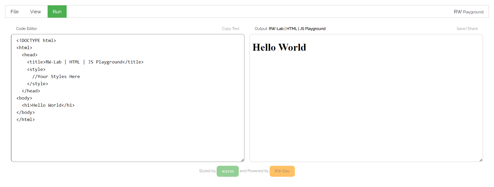

# JS | HTML | CSS Environment

A HTML | JavaScript| CSS Environment  - much similar to TryItEditor from W3 Schools

### Features
- Works fast and Almost offline (inital Load only)
- Dark Mode
- No Ads
- Download Your Output as PDF
- Download Code File

### Future Updates
- Open Local System Files (on going)
- Code Highlighting
- lil more Output Page Isolation

### Demo

[Demo - JS Env - Github.io](https://elvistony.github.io/js-env/ "HTML | CSS | JavaScript Enviroment")
